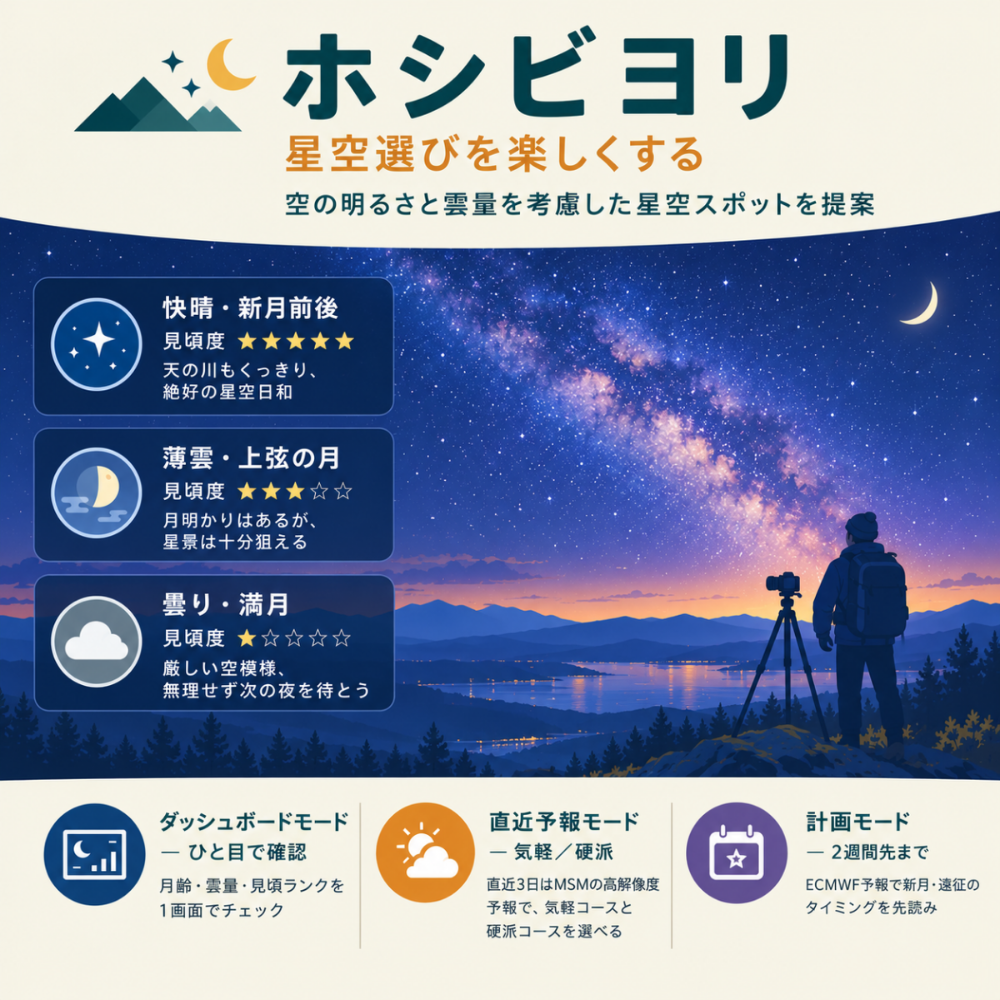

# ホシビヨリ (hoshibiyori)



星景写真撮影に特化した天気予報AIプロジェクト。**「観測者に寄り添う」**を方針に、地表から空を見上げる星空撮影者の目線で、月・雲・光害・地形の条件が揃う「夜 × 場所 × 時間帯」を探す。

登山者向けの姉妹プロジェクト[ヤマビヨリ](https://github.com/ktakemaru/yamabiyori)と同じデータ源(Open-Meteo経由の気象庁MSM+ECMWF IFS)を使うが、評価の軸は独立に設計している。登山者が「稜線がガスに巻かれるか・濡れるか」を見るのに対し、星空撮影者は「頭上の空のどれだけが雲に覆われるか」「薄い巻雲で天の川のコントラストが消えないか」を見る。この違いは`CLAUDE.md`の「観測者に寄り添う」セクションに比較表として記録している。

## できること(2026-09-13時点)

- **探索モード**(`explore_hoshibiyori.py`) — 直近14夜 × 候補地点146件を「月 → 雲 → 方角」の3段階漏斗で絞り込み、天の川銀河中心が狙える組み合わせをスコア順に出す。
  - 月フィルタ: 天文薄明終了〜開始(太陽高度−18°)のうち月が沈んでいる、または新月に近い時間帯を地点ごとに計算。
  - 雲フィルタ: 時間別の**視界遮蔽雲量**(観測者より上の雲)が30%以下で連続1時間以上続く「晴れ間」があるものだけ残し、その晴れ間を「見頃」として表示。直近約3日は気象庁MSM(約5km格子)、それ以降はECMWF IFS(0.25°)を時刻ごとに自動結合。
  - 方角フィルタ: 対象天体の方位・高度を計算し、地形地平線(国土地理院DEM)を上回り、光害(Light Pollution Atlas由来のLPI)が閾値以下の地点だけ残す。
- **レポート生成**(`generate_report.py`) — 探索結果を`report.html`に出力。「気軽コース」「硬派コース」(ロープウェイ・マイカー規制の有無)のTOP10、夜景系スポットの別枠、2週間先までの中期見込み(ECMWF、雲量は晴天率の参考表示のみ)、気象庁天気図のスクリーンショットを含む。
- **候補地点マスター**(`stargazing_spots.json`) — 星空撮影の専門家・愛好家サイトのWeb調査と外部リスト取り込みによる主軸146件(`spots`)と、OSM `tourism=viewpoint`由来の参考データ751件(`viewpoint_reference`)。各地点に光害LPI・簡易ボートル値・`site_type`(暗い空/夜景系)を付与。

## 見上げ型ハイブリッド雲量判定

`step5_cloud_forecast/elevation_cloud.py`。主指標はモデル本来の全層・下層・中層・上層雲量(MSM/ECMWFが直接出力する値)。気圧面別雲量(1000〜300hPa、各面の高度は毎時のジオポテンシャル高度)は**観測者より下の雲を差し引く**用途に限定し、山上の地点では雲海の上に出られるかを「雲海指数」として別に出す。低標高地点では視界遮蔽雲量はモデル本来の全層雲量に一致する。

設計の経緯(気圧面別雲量の全層ランダム重ね合わせが雲を平均+15.6pt過大評価していた検証など)は`CLAUDE.md`に記録している。

## ディレクトリ構成

| パス | 内容 |
|---|---|
| `step1_astronomy/` | 天体位置・薄明計算(Skyfield) |
| `step2_terrain/` | 国土地理院DEMタイルから方位角別の地形地平線仰角プロファイル |
| `step3_light_pollution/` | 光害レベル(Light Pollution Atlas バイナリタイル) |
| `step4_moonlight/` | 月明かりによる空の明るさ増加(Krisciunas & Schaefer 1991) |
| `step5_cloud_forecast/` | Open-Meteo雲量予報、見上げ型ハイブリッド雲量判定、格子セルキャッシュ、気象庁天気図取得 |
| `step6_viewpoint_survey/` | OSM viewpoint収集(参考データ) |
| `step7_geocoding/` | 候補地点の順/逆ジオコーディング(Nominatim)、重複検出 |
| `explore_hoshibiyori.py` | 探索モード本体 |
| `generate_report.py` | HTMLレポート生成 |
| `stargazing_spots.json` | 候補地点マスター |
| `CLAUDE.md` | 設計方針・経緯・既知の制約の記録(開発ログ兼仕様書) |

## セットアップ

Python 3.13以降を想定(開発環境は3.15 RC)。

```bash
pip install skyfield requests
python generate_report.py   # report.html を生成(初回はAPI取得のため10〜30分)
```

Skyfieldの暦ファイル(`de421.bsp`)は初回実行時に自動ダウンロードされる。外部データ(DEMタイル・光害タイル・雲量予報・天気図)はすべてディスクキャッシュされ、同一データの重複取得を避ける設計になっている。

## データ出典と利用上の注意

本ソフトウェア自体はMITライセンス(`LICENSE`)だが、実行時に取得・表示する各データにはそれぞれの提供元の条件が適用される。生成されるレポート(`report.html`)のフッターにも同じ出典表示を自動で含めている。

| データ | 提供元 | 条件・表示 |
|---|---|---|
| 気象予報(雲量・気圧面・ジオポテンシャル高度) | [Open-Meteo.com](https://open-meteo.com/)(気象庁MSM・ECMWF IFSの数値予報を配信) | [CC BY 4.0](https://creativecommons.org/licenses/by/4.0/)。「Weather data by Open-Meteo.com」の表示 |
| 標高(地形地平線) | [国土地理院 地理院タイル(標高タイル)](https://maps.gsi.go.jp/development/ichiran.html) | [国土地理院コンテンツ利用規約](https://www.gsi.go.jp/kikakuchousei/kikakuchousei40182.html)に基づき「**出典：国土地理院 地理院タイル(標高タイル)を加工して作成**」と表示 |
| 光害(人工夜空輝度) | David Lorenz, [Light Pollution Atlas](https://djlorenz.github.io/astronomy/lp/) | 個人運営サイト。明示的なライセンス表記なし。出典表示を行い、**公開サービスへ組み込む前に著者への利用可否確認が必要**(未実施)。ボートルスケール値は非公式の簡易近似 |
| 地上天気図・予想天気図 | [気象庁ホームページ](https://www.jma.go.jp/) | [気象庁ホームページ利用規約](https://www.jma.go.jp/jma/kishou/info/coment.html)に基づき出典表示 |
| 候補地点(OSM展望データ)・地名(ジオコーディング) | © [OpenStreetMap contributors](https://www.openstreetmap.org/copyright)(Overpass API・Nominatim) | [ODbL](https://opendatacommons.org/licenses/odbl/)。Nominatimは[利用規約](https://operations.osmfoundation.org/policies/nominatim/)(1リクエスト/秒以下・識別可能なUser-Agent・結果のキャッシュ)を遵守 |
| 天体位置 | JPL DE421 暦([Skyfield](https://rhodesmill.org/skyfield/)経由で自動取得) | パブリックドメイン(NASA/JPL) |
| 星空撮影名所(curated) | 星空撮影の専門家・愛好家サイト、自治体観光サイト等のWeb調査 | 地名・座標のみを収録。説明文は独自に要約 |

**アクセスの節度**: いずれの提供元に対しても、タイル/格子セル単位のディスクキャッシュ、新規取得時のポライトネス・ディレイ、識別可能なUser-Agentを維持している。これらを無効化しないこと。

**免責**: 本プロジェクトは数値予報データを個人の星景撮影計画のために整理・表示するツールであり、気象庁その他の機関による予報・警報ではない。予報の的中を保証せず、現地での判断は利用者自身の責任で行うこと。気象業務法上の「予報業務」として第三者に提供するものではない。

## ステータス

ステップ1〜7まで実装・検証済み。個人利用の検証段階であり、公開サービスではない。今後の課題は`CLAUDE.md`「今後の課題」参照。

## ライセンス

本ソフトウェアのソースコードは[MIT License](LICENSE)で公開する。バナー画像(`assets/`)を含むリポジトリ内の独自コンテンツも同じ扱いとする。実行時に取得する外部データには上記「データ出典と利用上の注意」の各提供元の条件が別途適用される。
